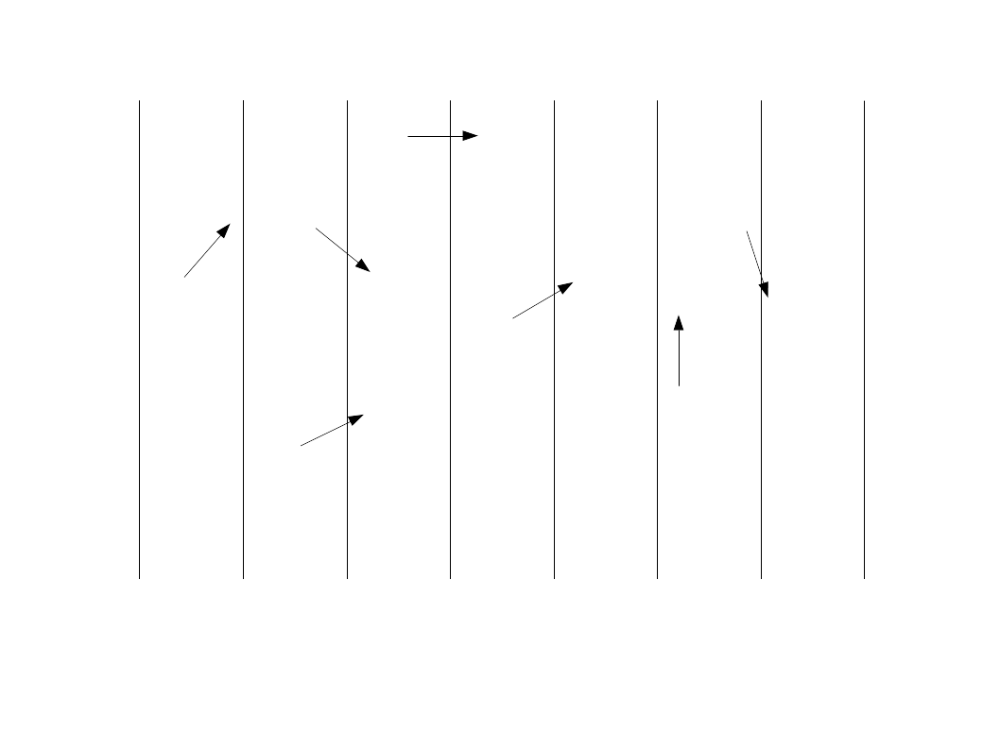
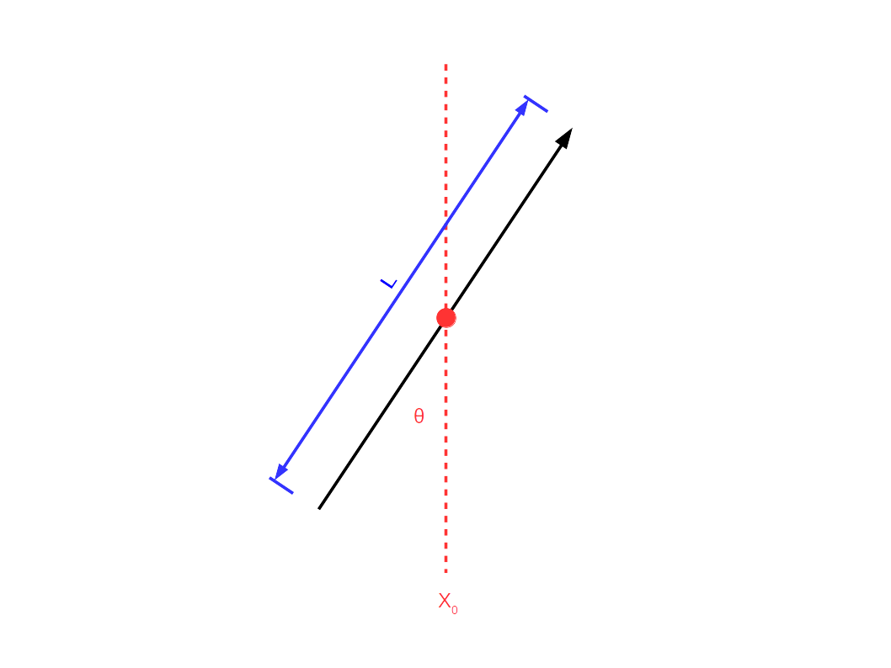
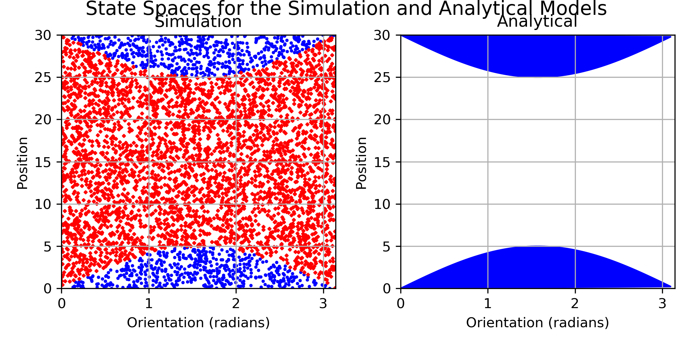
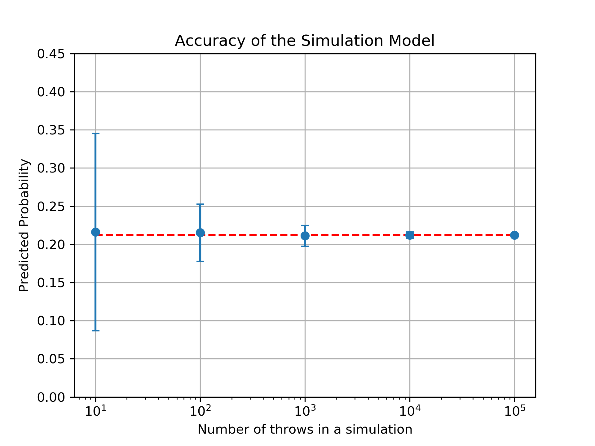

# The Buffon's Needle Problem

Buffon's Needle is a probability problem originally discussed in the 18th century. The problem revolves around needles of a given length and a floor marked with infinite parallel, equidistant lines. Figure 1 shows an example of the floor in this problem. The goal is to determine the probability that a dropped needle will intersect one of those lines. This is a perfect problem to introduce computational modelling because there is an analytical solution that can be used to verify the model.

{:.centerr}
<figure>

<figcaption>
Fig 1. This is the floor for the Buffon's Needle problem. The vertical lines are the lines on the floor and they repeat infinitely. The arrows are examples of needles that have fallen on the floor. Some of the needles overlap the lines and some of them do not.
</figcaption>
</figure>

For the sake of simplicity, two assumptions are being made for the work done in this chapter. The first assumption is that the length of the needle is less than the distance between the lines on the floor, eliminating the possibility that a needle could intersect two or more lines on the floor. The second assumption is that the location needles land on the floor, and the orientation of the needle as it falls are both uniformly distributed. 

# Representation of the Needle and the Floor

For the analytical and the simulation approach it is important to define a representation for needles and the floor. The position and orientation of each needle was defined by the Cartesian coordinates of the center of the needle and the angle ($0 \leq \theta \leq 2\pi$ in radians) between a vertical line and the needle. The floor will be represented as the distance between the parallel vertical lines. Every line is infinitely long in the $y$ direction and they repeat ad infinitum in the $x$ direction. 

To make both models easier to work with, the representations can be simplified. Due to the rotational symmetry of a needle, it is not necessary to use the full range $0 \leq \theta \leq 2\pi$ to represent the orientation of the needle. The needle rotates about its center, so an orientation of $0$ is the same as an orientation of $\pi$. This means the range of angles can be restricted to $0 \leq \theta \leq \pi$.

It is unwieldy to drop needles on an infinite plane, so bounding our axes will save us later. The $y$ coordinate of a needle has no influence over whether it intersects a line. With everything else held constant, a change the $y$ value of a needle will not impact whether it intersects a line.

The lines repeat in the $x$ direction and are evenly spaced a distance $l$ apart. The space between two lines can be defined as a chunk, and it can be seen that the probability of a needle intersecting a line is the same no matter what chunk it is in. Therefore, finding the probability that a needles intersects a line in a chunk will give the probability that a needle intersects a line when dropped anywhere on the floor. This restricts the possible $x$ coordinates for a needle to be $0 \leq x \leq l$.

{:.centerr}
<figure>

<figcaption>
Fig 2. An example of a needle used in this thought experiment. It shows the angle from vertical $\theta$, the length of the needle $l$, and the position of the needle $x$.
</figcaption>
</figure>

With this information, the state space for needles can be constructed. The x-value exists from $0 \leq x \leq d$ and the $\theta$ value exists from $0 \leq \theta \leq \pi$. Equation 1 shows the state space for the problem.

\begin{equation} \label{statespace of needle}
    $$R := \{(x, \theta) | 0 \leq x \leq d, 0 \leq \theta \leq \pi\}$$
\end{equation}

# Analytical Solution to Buffon's Needle

One of the benefits of this problem is that there is an exact analytical solution that can verify the simulation model. This analytical solution can be found by working with areas inside the state space defined for the needle in equation 1.

Dropping a needle on the floor is the same as uniformly sampling the state space because all positions and orientations of the needle are equally likely when it is dropped. Thus the fraction of the space that represents an intersection is the probability that a randomly dropped needle intersects a line. This can be calculated because the size of the state space is finite.

In one chunk, the needle can either intersect the line that is at $x=0$ (left line) or the line at $x=d$ (right line). All needles have a center between 0 and $d$, so if an endpoint of the needle is less than 0 or greater than $d$ then it must cross a line. The needle crosses the left line when $x - \frac{l}{2} * sin(\theta) < 0$, and it crosses the right line when $x + \frac{l}{2} * sin(\theta) > d$.

These equations can be solved analytically to find the total area inside the state space that they satisfy. they can be re-arranged to be in terms of $\theta$ to make integration simpler. The equation for the left line becomes $x < \frac{l}{2} * sin(\theta)$. Equation 2 goes through solving for the area under the lower curve.

\begin{equation}
\label{buffon area down}
    A_{lower} = \int_{0}^{\pi}(\frac{l}{2} * sin(\theta))d\theta\\
    A_{lower} = l
\end{equation}

The same process is done for the right line to find the area above the upper curve. The inequality for determining if a needle intersects the right line is rewritten $x > d - \frac{l}{2} * sin(\theta)$. This is solved in equation 3.

\begin{equation}
\label{buffon area up}
    A_{upper} = \int_{0}^{\pi} (d - \frac{l}{2} * sin(\theta)) d\theta\\
    A_{upper} = l
\end{equation}

The last step is to find the total area of the state space. This is done by taking a double integral over both axes. Equation 4 shows the calculation of the total area of the state space.

\begin{equation}
\label{buffon area total}
    A_{total} = \int_{0}^{d} \int_{0}^{\pi} d\theta dx\\
    A_{total} = d\pi
\end{equation}

The probability that a needle intersects a line when it is randomly dropped is the fraction of the space that represents an intersection. The probability that a randomly dropped needle intersects a line is $P_{intersection} = (A_{lower} + A_{upper}) / A_{total} = \frac{2l}{d\pi}$.

# Simulation Approach to Buffon's Needle

The simulation approach is to take uniformly distributed samples from the state space, and keep track of how many samples would intersect a line. A given sample intersects a line if it satisfies either $x + \frac{l}{2} * sin(\theta) > d$ or $x - \frac{l}{2} * sin(\theta) < 0$. Because the samples are uniform, they are representative of the entire state space as a whole. 


struct Needle
    l::Float64
    x::Float64
    $\theta$::Float64
end


The code shown above is the struct used to represent a single needle in the simulation. For each cycle of the simulation a needle is ``thrown'' onto the floor by sampling uniformly from the state space. It gets a random number between 0 and $\pi$ for $\theta$ and a random number between 0 and $d$ for $x$. The value for $l$ is set by the specifications for the particular simulation.

# Testing the Validity of the Model

To compare these methods, the state spaces for these methods can be plotted side by side. Figure 3 shows the area in the state spaces that result in the needle intersecting a line. The blue in each plot highlights the region in the state space that results in a needle intersecting a line. 

The analytical model provides the exact solution. If the results of the simulation match the analytical model then the simulation is accurate and provides relevant data. The results of the two models estimating needles of length 10 and a distance between lines of 30 are shown in figure 3. The blue shaded areas of both plots cover the same regions, so the simulation model is a fairly strong approximation for the analytical approach. 

{:.centerr}
<figure>

<figcaption>
Fig 3. Comparison of the simulation and analytical approaches. The blue area in each graph represents a state that results in the needle intersecting a line. Red dots in the simulation plot represent samples that did not intersect a line. These are generated from a run where the distance between the lines is 30 and the length of the needle is 10.
</figcaption>
</figure>

One way of showing that the simulation is accurate is to compare directly with the exact solution. The number of throws in a simulation can be compared to the mean of the results to find how accurate the model is. Figure 4 shows the mean (as a point) and standard deviation (as error bars) as the number of throws increases. Once the number of throws reaches $10^{5}$ the error bars are no longer visible. The simulated data from figure 3 was collected with 5,000 samples, where the standard deviation is around 0.02.

{:.centerr}
<figure>

<figcaption>
Fig 4. Mean and standard deviation over a varying number of throws. Each number of throws was tested with 100 simulations. The mean of the data is shown as the point and the standard deviation is represented with the error bars.
</figcaption>
</figure>

# Applications to Computer Simulation

The simulation method for Buffon's needle is not required because the analytical approach simplifies to a simple equation. However, this is a useful tool for showing how a simulated model can be developed when there is no exact solution present.
% area works because it is being uniformly sampled
