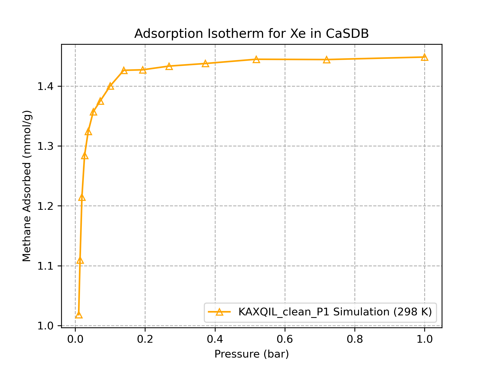

# Grand-Canonical Monte Carlo Simulation

`PorousMaterials.jl` uses a method similar to the Buffon's needle problem for estimating the interactions between adsorbate gasses and a structure. By exploring the potential statespace and then calculating the average, we can generate an approximation for both of these problems. However, in the Buffon's needle problem we made the assumption that the statespace is uniformly distributed, i.e. there is an equal probability of each $(x, \theta)$ pair occuring. By examining figure 3 in the Buffon's needle post, it is easy to see that the outcome of throwing the needle is evenly distributed across the entire statespace. This is not true of gasses in porous structures.

The statespace for this molecular model is based on the number of total adsorbate molecules in the system, and their positions, shown in equation 1. These states should not occur with equal probability in order to accurately simulate the real world process. For instance, having millions of overlapping atoms, and having an energetically balanced system should not occur with the same probability. To favor realistic permutations, `PorousMaterials.jl` uses the grand-canonical Monte Carlo algorithms for exploring the statespace of gasses inside porous materials.

\begin{equation}
R := \{N, \vec{x}_1, \cdots, \vec{x}_N\}
\end{equation}

The simulation works by proposing one of three trial moves: insertion, deletion, or translation. Then acceptance rules are used to calculate the percent probability that the move is accepted based on the change in energy. A very large change in energy (potentially due to overlapping atoms) will never be accepted, a slight increase in energy will sometimes be accepted, and a decrease in energy will always be accepted. This allows the program to examine the entire statespace, but only travel to realistic areas. Having a small chance of increasing the energy in the system at each step prevents the model from becoming stuck in a local minima and gives it the chance to properly explore physically viable states. At the end of the simulation, information about the visited states (such as energy and number of adsorbates) can be averaged to form an estimate for the system. 

The assumption this model is built on is that there is a small subset of states within $R$ that represent energetically favorable configurations within the MOF, and that all other states are either impossible (overlapping atoms), or extremely unlikely. By exploring these viable states and collecting information about the number of adsorbates and the energy of the system, we can average these values at the end to give an estimate for the interaction between the MOF and the gas. To make this accurate, we should visit states proportional to their occurence. This forms the basis that we should always transition to a more favorable state, and we transition to a less favorable state according to a Metropolis Hasting Algorithm which factors in the relative probability of each state.

# Acceptance Rules

The grand-canonical Monte Carlo acceptance rules are based on the following equation (ref 3).

\begin{equation}
f_L({\mathbf r}_1,{\mathbf r}_2 ..., {\mathbf r}_N) \propto \frac{\Lambda^{-3N}}{N!} e^{\beta \mu N} e^{-\beta U_N}\qquad\qquad\text{(2)}
\end{equation}

Where $N$ is the total number of particles (adsorbates) in the system.

All trial moves are accepted with probability $acc = min(1, \alpha)$ where $\alpha$ is defined below for each trial move. The $min$ function is used because some $\alpha$ values can be greater than 1. An $\alpha$ value greater than 1 means that the trial move has changed the state to be more energetically favorable and it will always be accepted. An $\alpha$ value close to 0 means the new state from the trial move is extremely unfavorable, due to something like overlapping atoms, so it will never be accepted. A change to a less energetically favorable, but still viable, state will be accepted with a random probability (hence Monte Carlo). This prevents the system from being trapped inside local energy minima, and allows the simulation to explore the full state space of the MOF.

## Insertion

\begin{equation}
\alpha = \frac{\mu * V}{k_B * T * (N + 1)} * e ^{\frac{-(U_{N+1} - U_N)}{T}}
\end{equation}

## Deletion

\begin{equation}
\alpha = \frac{(N - 1) * k_B * T}{\mu * V} * e ^{\frac{U_N - U_{N - 1}}{T}}
\end{equation}

## Translation

\begin{equation}
\alpha = e ^{\frac{U_{new} - U_{old}}{T}}
\end{equation}

# Implementation in PorousMaterials.jl

The [muVT\_sim](https://simonensemble.github.io/PorousMaterials.jl/stable/manual/mof_simulations/#PorousMaterials.gcmc_simulation) requires five arguments: crystal, molecule, temperature, pressure, and forcefield. It has numerous keyword arguments that can control various aspects of the simulation such as the number of cycles, or whether it will track adsorbate positions. The crystal and the molecule are the MOF and adsorbate pair that are being tested. The temperature and pressure set the respective elements of the simulation. These are held constant for the entirety of the simulation, the [adsorption\_isotherm](https://simonensemble.github.io/PorousMaterials.jl/stable/manual/mof_simulations/#PorousMaterials.adsorption_isotherm) function allows the user to iterate over a range of pressures and has the potential to be run in parallel. The forcefield defines atomic interactions for the simulation, some examples include the unviersal forcefield (handles all elements and several molecules that can be modelled as spheres) and the Dreiding forcefield (more accurate values for interactions between a subset of elements).

The simulation has two phases of cycles which can be controlled with keyword arguments: burn cycles and sample cycles. The system begins with no adsorbates present, and if samples are taken from the beginning of the simulation, the data will skew to show fewer adsorbates than are actually present. Therefore burn cycles are used where the trial moves are beign proposed and accepted or rejected but no data is being collected. This gets the system close to an energetically favorable configuration, and from this point onward it is exploring a small subset of the state space of the MOF that represent viable configurations of adsorbates within the MOF. Sample cycles collect information about the current state of the system. and at the end of the simulation, these values are averaged to generate the estimate for gas adsorption, system energy, etc.

Each cycle contains $min(N, 20)$ trial moves and will collect data at the end of all trial moves if it is a sample cycle. As the simulation runs, the adsorbate molecules are represented as Molecule structs within the code (and either store fractional or cartesian coordinates), and they are kept in an array of molecules. Each trial move relies on calculating the energy between the molecule being observed and all other adsorbate molecules (guest-guest interactions) and all atoms in the framework (guest-host interactions).

When an insertion is proposed, a molecule is generated with a random rotation and position and appended to the end of the array. The energy from guest-guest and guest-host interactions are calculated for the new molecule, and the energy is used with the insertion acceptance rule. If it is accepted, the array will be kept the same. If it is rejected, the last element of the array of molecules will be removed.

When a deletion is proposed, a random element of the array is selected and its index is stored. The energy is calculated and used the same as the insertion trial move. If it is accepted, that element is removed from the array of adsorbate molecules. If it is rejected, then the array will not be modified. 

A translation is more complicated, because the energy of the system must be calculated twice. First a random molecule is selected and its guest-guest and guest-host interactions are stored as the old energy. Then the molecule is randomly translated and its old coordinates are saved separately. Then the guest-guest and guest-host interactions are calculated as the new energy. Both of these energies are used to determine the acceptance. If the move is accepted, then the array of molecules is left because the random translation changes the element of the array. If it is rejected, the molecule is overwritten with the save of the old position. 

After all cycles have been completed, the data values are cleaned up and saved into a results dictionary that is output from the function.

# Usage in Julia

All of the simulation is abstracted away from the user, they only need to read in the files they wish to use and pass them as arguments to the muVT\_sim or adsorption\_isotherm functions. An example of this is shown below:

```julia
using PorousMaterials

# read in the structure CaSDB and remove artefacts from the cif file
structure = Crystal("casdb_clean_P1.cif")
strip_numbers_from_atom_labels!(structure)

# read in the universal forcefield
ljforcefield = LJForceField("UFF")

# read in the molecule Xe
molecule = Molecule("Xe")

# run a single GCMC simulation with a pressure of 1.0bar and 298.0K
result = muVT\_sim(structure, molecule, 298.0, 1.0, ljforcefield; n\_burn\_cycles=2000, n\_sample\_cycles=7000)

# run a range of simulations from 0.01bar to 1.0bar and 298.0K
pressures = 10 .^ range(-2, stop=log10(1.0), length=15)
results = adsorption_isotherm(structure, molecule, 298.0, pressures, ljforcefield, n\_burn\_cycles=10000, n\_sample\_cycles=10000)
```

Using the output from the above adsorption\_isotherm function call, we can create a full adsorption isotherm for Xe in CaSDB.


