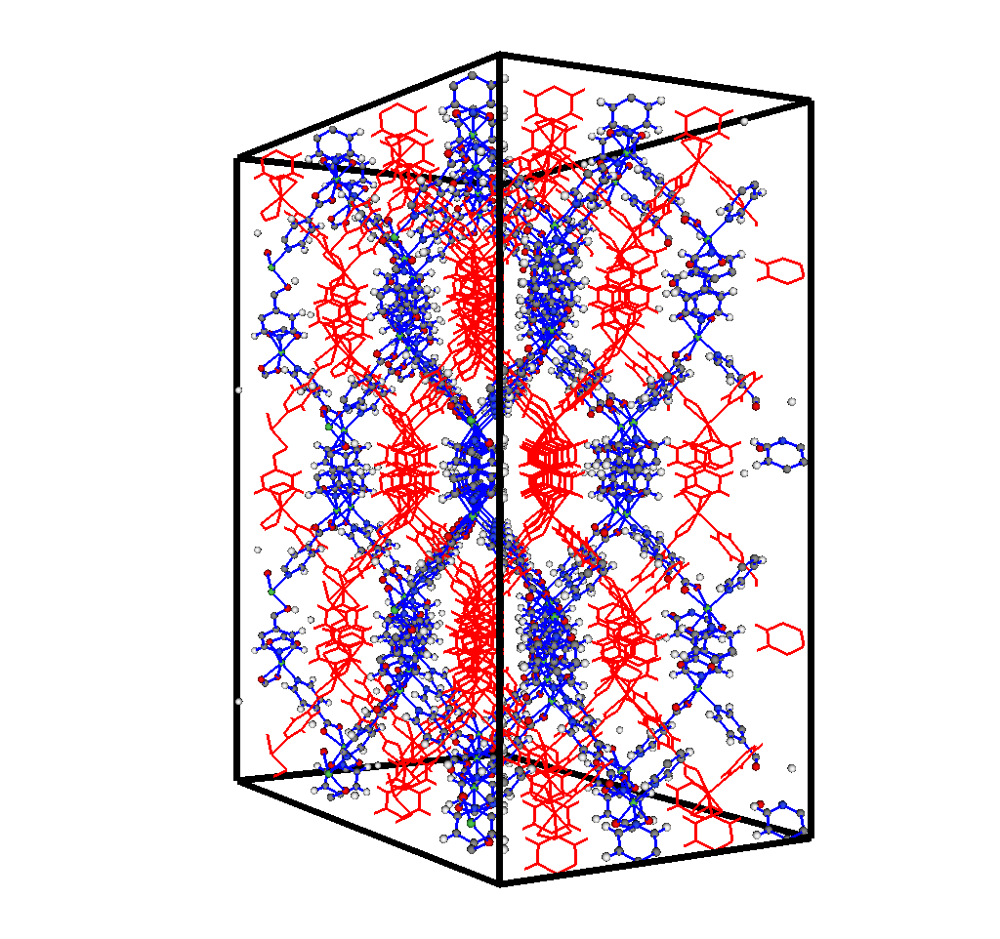

# Motivation for Generating Bond information in PorousMaterials.jl

When I started working with hypothetical MOFs, the structures I made were never in the lowest energy configuration so I needed to use molecular dynamics software like LAMMPS to relax them. Hoever LAMMPS would infer bonds based on distance and it would tear my structures instead of relaxing them. The solution I arrived at was to generate bonding information within PorousMaterials to enforce that the linkers I was inserting would be correctly bonding to themselves and nothing else. This information is extremely useful for hypothetical MOF construction and is currently being used for a find-and-replace MOF funtionalizer by Adrian Henle (a graduate student in the SimonEnsemble).

# Generating Bonding Information

To generate bonds within a structure, there need to be rules that define which atoms are elegible for bonding and a way to apply those rules. I used the infer bonds functionality from ViSiT as inspiration for the format of the bonding rules. I then made a brute force algorithm that iterates through all pairs of atoms and determines if they are bonded based on the set of bonding rules being applied. the bonds are stored in an undirected, unweighted graph where each vertex represents an atom, and each edge represents a bond.

## Bonding Rules

ViSiT allows the user to specify the species of two atoms that can be bonded, the minimum distance for them to bonded, and the maximum distance for them to be bonded (distances in Angstroms). It also allows the user to specify wildcards and make generic rules such as a min and max distance for any pair of atoms to be bonded, or a min and max distance for any atom and hydrogen. I made the [BondingRule](https://simonensemble.github.io/PorousMaterials.jl/stable/manual/boxes_crystals_grids/#PorousMaterials.BondingRule) struct to hold all of this information.

```julia
struct BondingRule
    species_i::Symbol
    species_j::Symbol
    min_dist::Float64
    max_dist::Float64
end
```

To infer bonds, a user makes an array of bonding rules. When applying these rules, it must try to use the first rule it finds that matches the atom species. This is to prevent some rules from being redundant. For example, the default bonding rules specifies a distance for any atom and hydrogen (0.4-1.2), and a longer distance for any pair of atoms (0.4-1.9). The first rule is pointless if the system isn't forced to use it because a carbon and hydrogen 1.5 Angstroms apart would match the types for the first rule but not the distance, and then satisfy the second rule. This follows common sense because hydrogen is the smallest atom and has a short interaction radius, it woulnd't make sense for it to have the same range as all other atoms.

```julia
bonding_rules = [BondingRule(:H, :*, 0.4, 1.2),
                 BondingRule(:*, :*, 0.4, 1.9)]
```

## Inferring Bonds

The method for inferring bonds is a simple brute force algorithm that iterates through all pairs trying to find a match. If it finds a match, it adds an edge to the bonding graph. The is\_bonded function is used to determine if a pair of atoms are bonded based on the given bonding rules. It first checks to see if the species match any of the rules. If it finds a rule that matches it will return true if the atoms are within the bonding distance or false if they are not. This enforces that a pair of atoms must meet the distance requirement of the first rule that matches their species.

```julia
function is_bonded(crystal::Crystal, i::Int64, j::Int64,
                   bonding_rules::Array{BondingRule, 1}=[BondingRule(:H, :*, 0.4, 1.2), BondingRule(:*, :*, 0.4, 1.9)];
                   include_bonds_across_periodic_boundaries::Bool=true)
    species_i = crystal.atoms.species[i]
    species_j = crystal.atoms.species[j]
    
    r = distance(crystal.atoms, crystal.box, i, j, include_bonds_across_periodic_boundaries)

    # loop over possible bonding rules
    for br in bonding_rules
        # determine if the atom species correspond to the species in `bonding_rules`
        species_match = false
        if br.species_i == :* && br.species_j == :*
            species_match = true
        elseif br.species_i == :* && (species_i == br.species_j || species_j == br.species_j)
            species_match = true
        elseif br.species_j == :* && (species_i == br.species_i || species_j == br.species_j)
            species_match = true
        elseif (species_i == br.species_i && species_j == br.species_j) || (species_j == br.species_i && species_i == br.species_j)
            species_match = true
        end

        if species_match
            # determine if the atoms are close enough to bond
            if br.min_dist < r && br.max_dist > r
                return true
            else
                return false # found relevant bonding rule, don't apply others
            end
        end
    end
    return false # no bonding rule applied
end
```

# Applications

As noted above, bonding information is extremely useful for generating hypothetical MOF structures. It can expedite the relaxation process or be used to search a structure for a subgraph using the Ulmann algorithm. Another benefit I discovered was separating distinct structures within interpenetrated MOFs. These are MOFs that have disjoint structures that are woven together and form a MOF. An example is NiPyC2. To prove that the bonding information was working correctly, I wrote a script to infer the bonds on the structure, locate the connected components of the bonding graph, and use that to separate the MOF into its component parts.

```julia
using PorousMaterials
using LightGraphs
using Printf

# read in NiPyC2 and replicate to be 4, 4, 4
filename = "NiPyC2.cif"
structure = Crystal(filename)
strip_numbers_from_atom_labels!(structure)
structure = replicate(structure, (4, 4, 4))

# make bonding rules
bonding_rules = [BondingRule(:H, :*, 0.4, 1.2),
                 BondingRule(:N, :Ni, 0.4, 2.5),
                 BondingRule(:O, :Ni, 0.4, 2.5),
                 BondingRule(:*, :*, 0.4, 1.9)]

# create bonds on NiPyC2
infer_bonds!(structure, true, bonding_rules)

# find the separate components - there should be 2
interpenetrated_components = connected_components(structure.bonds)
@printf("The crystal %s has %d connected components", filename,
        length(interpenetrated_components))

comp_1 = structure[interpenetrated_components[1]]
comp_2 = structure[interpenetrated_components[2]]
```

After outputting the separate structures and bonds in xyz and vtk files, they can be opened in ViSiT and colored to differentiate the two distinct structures that form NiPyC2.


