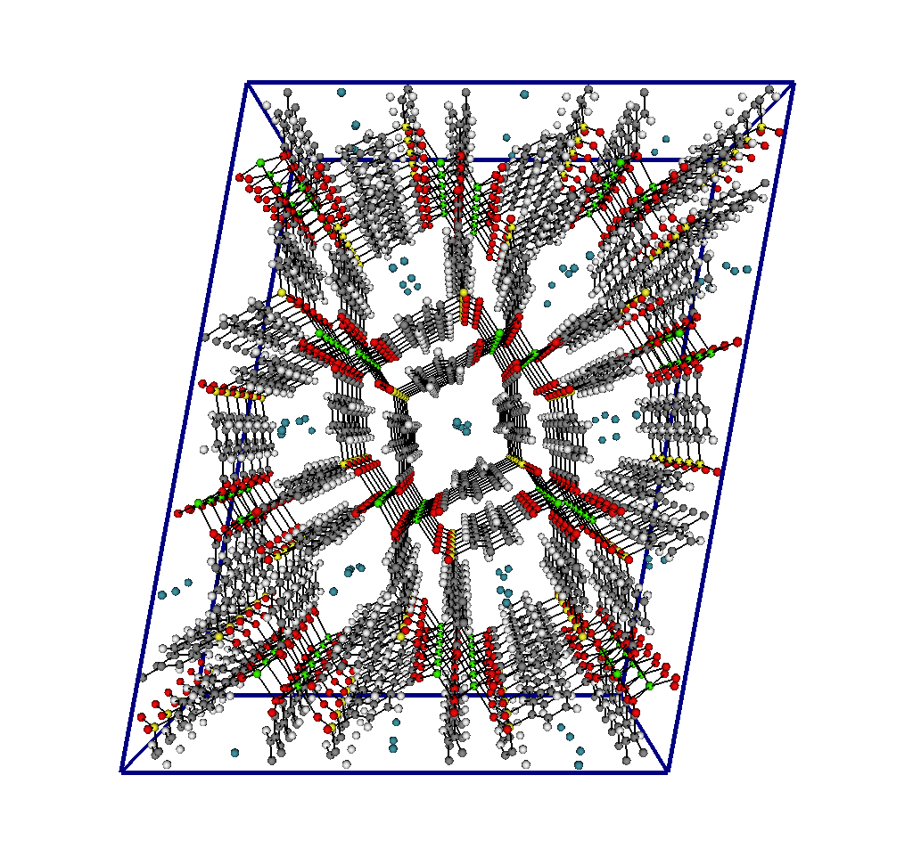
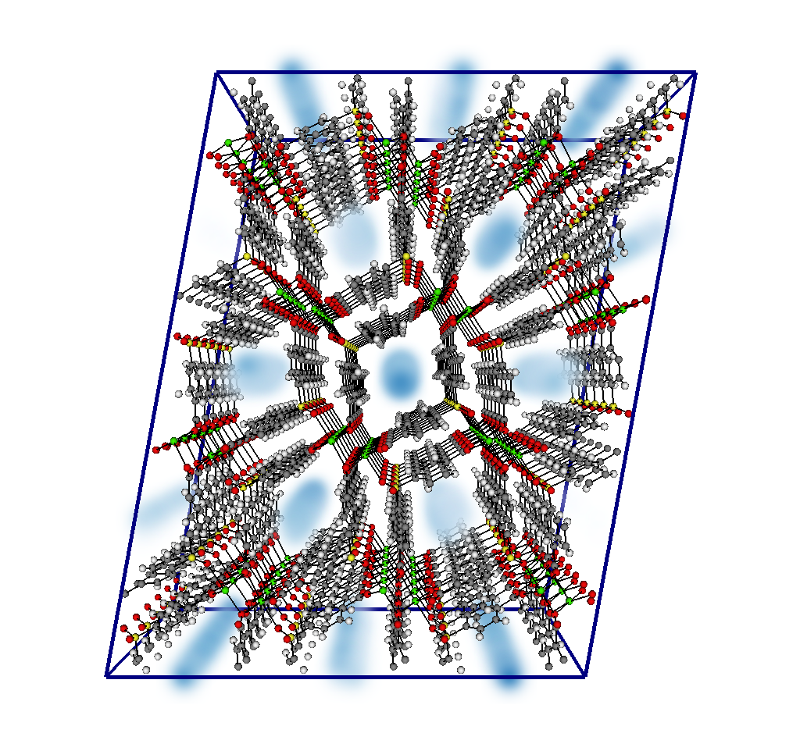

# Importance of Tracking Positions

PorousMaterials.jl is intended for use with metal-organic frameworks, but it can be used to model a wide range of nano-porous materials. There are some significant benefits of modelling non-crystalline nano-porous materials, one of which being that a simulation can track the positions of adsorbates while x-ray diffraction cannot due to the unordered nature of the structure. When an experimentalist reached out to our group with this issue, I was put in charge of adapting our existing code to store and output the positions of the molecules during the simulation so that we can infer adsorption sites. 

# Taking Snapshots of Individual Molecules

The first method used for tracking positions was to capture the position of every molecule at a given cycle and output their coordinates to an xyz file. An interesting benefit of this method is that by formatting the xyz file correctly, one can obtain a "movie" where the atoms can be seen moving around. This is interesting to visualize where atoms appear in the system, but because the simulation is an exploration of state space and independent of time the movement of atoms is not indicative of how they move in the real system.

There are two keyword arguments used in the [muVT\_sim](https://simonensemble.github.io/PorousMaterials.jl/stable/manual/mof_simulations/#PorousMaterials.gcmc_simulation) function call to control the snapshots. The first is write\_adsorbate\_snapshots which serves as a toggle for whether or not the simulation will open a file and write information to it at given intervals. The other is snapshot\_frequency. This determines how many cycles between each snapshot being taken. A value of 1 means a snapshot is taken every cycle, 2 means every other cycle and so on. The default is that snapshots will not be taken (it is time consuming and if they aren't needed it speeds up the simulation), and that a snapshot is taken every cycle.

During the simulation, a filestream object is opened before any cycles occur with a filename generated by the [muVT\_output\_filename](https://simonensemble.github.io/PorousMaterials.jl/stable/manual/mof_simulations/#PorousMaterials.gcmc_result_savename) function with an xyz extension. If the user does not want to create snapshots, the filestream object is created for scoping purposed but never opened. Nothing is output to the file during the burn cycles, but every snapshot\_frequency sample cycles the current array of molecules will be output to the file using the write\_xyz file shown below. The xyz file needs to have the molecule positon in cartesian coordinates, but because the molecules are stored in fractional coordinates for the simulation the simulation box must be passed in to convert the fractional to cartesian coordinates.  

```julia
function write_xyz(box::Box, molecules::Array{Molecule{Frac}, 1}, xyz_file::IOStream)
    num_atoms = sum([mol.atoms.n for mol in molecules])
    @printf(xyz_file, "%s\n", num_atoms)
    for molecule in molecules
        for i = 1:molecule.atoms.n
            x = Cart(molecule.atoms[i].coords, box)
            @printf(xyz_file, "\n%s %f %f %f", molecule.atoms.species[i], x.x...)
        end
    end
end
```

At the end of the simulation, the file is closed. and can be read into a vizualization software such as ViSiT to view their positions. The image below shows Xenon atoms (blue) inside the CaSDB MOF. The dark blue box is the simulation box used for the simulation. The unit cell for CaSDB was replicated by (3, 6, 2) to create the full simulation box.



# Tracking Adsorbates within Voxels

Tracking the positions of individual atoms can be useful for understanding how this simulation works, but they do not provide conclusive data on where likely adsorption sites are located. To combat this, I set up a system that tracks teh number of occurences of adsorbates within voxels instead of tracking individual adsorbate positions. I use a [Grid](https://simonensemble.github.io/PorousMaterials.jl/stable/manual/boxes_crystals_grids/#PorousMaterials.Grid) object and superimpose it over the entire simulation box so that each element of the density grid corresponds to a voxel in the simulation. At every snapshot, I increment each element of the density grid by the number of adsorbates that appear in the related voxel. At the end of the simulation I divide each element of the density grid by the number of snapshots taken to find the probability an adsorbate will be located at that position. 

The density grid functionality is controlled by the snapshot\_frequency and three other keyword arguments. The snapshot\_frequency still controls how many sample cycles between each update of the density grid. The calculate\_density\_grid determines whether the simulation will perform these snapshots. The density\_grid\_dx determines the spacing between individual voxels of the grid (in Angstroms). The density\_grid\_species determines the atom that will be counted in the density grid. This only needs to be specified if the adsorbate has more than one unique atom in it. 

Before the cycles begin, the density grid is set up so that each voxel is correctly spaced by comparing the size of the box to the minimum voxel spacing. If a density grid is not being kept, it will default to having 0 points in all directions. After every snapshot\_frequency sample cycles, the grid will be updated with the [update\_density!](https://simonensemble.github.io/PorousMaterials.jl/stable/manual/boxes_crystals_grids/#PorousMaterials.update_density!) function. It iterates through every molecule in the adsorbate array and converts its fractional coordinates to an index in the density grid using [xf\_to\_id](https://simonensemble.github.io/PorousMaterials.jl/stable/manual/boxes_crystals_grids/#PorousMaterials.xf_to_id) (shown below). It then increments the grid at that index. At the end of the simulation, every entry of the density grid is divided by the number of snapshots taken. The resulting grid is stored in the results dictionary for later use. 

```julia
function xf_to_id(n_pts::Tuple{Int, Int, Int}, xf::Array{Float64, 1})
    voxel_id = floor.(Int, xf .* n_pts) .+ 1
    # because of periodic boundary conditions, some adsorbate positions fall
    #   outside the simulation box, they are translated back within the box by
    #   either adding or subtracting n_pts.
    for k = 1:3
        if voxel_id[k] <= 0
            voxel_id[k] += n_pts[k]
        elseif voxel_id[k] > n_pts[k]
            voxel_id[k] -= n_pts[k]
        end
    end
    return voxel_id
end
```

To visualize the density grid, it first needs to taken from the results dictionary and written to a .cube file. This file can then be opened in a visualizer such as ViSiT alongside the crystal structure, and it will appear as a cloud density plot. The figure below shows the density grid laid over CaSDB. The dark blue indicates a high probability of a Xenon atom beign found at that location. The light blue and white mean there is a low or zero probability of a xenon beign located there. 



The results from the individual atom snapshots and the density grid can be viewed at the same time in ViSiT for an interesting visual. Here I took all 100 individual atom snapshots and laid them over the density grid cloud plot and generated a gif. 


